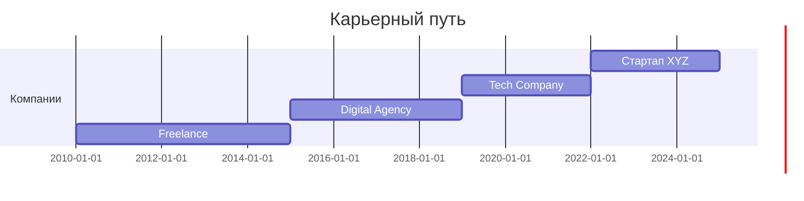

<div align="center">
  
# 👨‍💻 DeNNNNN999

[](https://dennnnn999.github.io/project/)
[](https://linkedin.com)
[](https://twitter.com)

### Full-Stack Developer | Architect | Tech Enthusiast


</div>

## 🚀 О себе | About Me

```javascript
const developer = {
  name: "DeNNNNN999",
  role: "Senior Full-Stack Developer",
  languages: ["JavaScript", "TypeScript", "Python", "SQL"],
  architectures: ["Microservices", "Event-driven", "JAMstack"],
  challenge: "Создаю инновационные и масштабируемые решения для веба"
};

console.log(`👋 Привет, я ${developer.name}!`);
```

Я фокусируюсь на создании высококачественных приложений с использованием современных технологий и лучших практик разработки. Постоянно изучаю новое в мире веб-разработки и делюсь своими знаниями с сообществом.

## 💻 Технологический стек | Tech Stack

<div align="center">


### ⚡ Frontend


### 🚀 Backend


### 🛠️ DevOps & Инструменты | Tools


</div>

## 📊 Статистика GitHub | GitHub Stats


<div align="center">
  
  
  
  

  <a href="https://www.codewars.com/users/DeNNxD">
    
  </a>
</div>

## 🔥 Активность | Activity

<div align="center">
  
</div>

## 📌 Избранные проекты | Featured Projects

<div align="center">

[](https://github.com/DeNNNNN999/project)

</div>

## 🌱 Сейчас изучаю | Currently Learning

<div align="center">
  <table>
    <tr>
      <td align="center" width="33%">
        
        <br />
        Web3 и блокчейн
      </td>
      <td align="center" width="33%">
        
        <br />
        AI и ML
      </td>
      <td align="center" width="33%">
        
        <br />
        Микрофронтенды
      </td>
    </tr>
  </table>
</div>

## 💼 Опыт работы | Work Experience


```mermaid
gantt
    title Карьерный путь
    dateFormat  YYYY
    section Компании
    Стартап XYZ           :2022, 2025
    Tech Company          :2019, 2022
    Digital Agency        :2015, 2019
    Freelance             :2010, 2015
```

## 📫 Связаться со мной | Contact Me

<div align="center">
  
[](mailto:example@gmail.com)
[](https://t.me/username)
[](https://discord.com/users/123456789)

</div>

## 🎮 Небольшой fun-факт | Fun Fact

<div align="center">
  <details>
    <summary>Нажми, чтобы увидеть мой уровень настроения в разных языках программирования 😄</summary>
    <br />
    
    
    
    
    
  </details>
</div>

---

<div align="center">
  
  
  
  
  ### "Код — это поэзия, написанная логикой"
</div>
